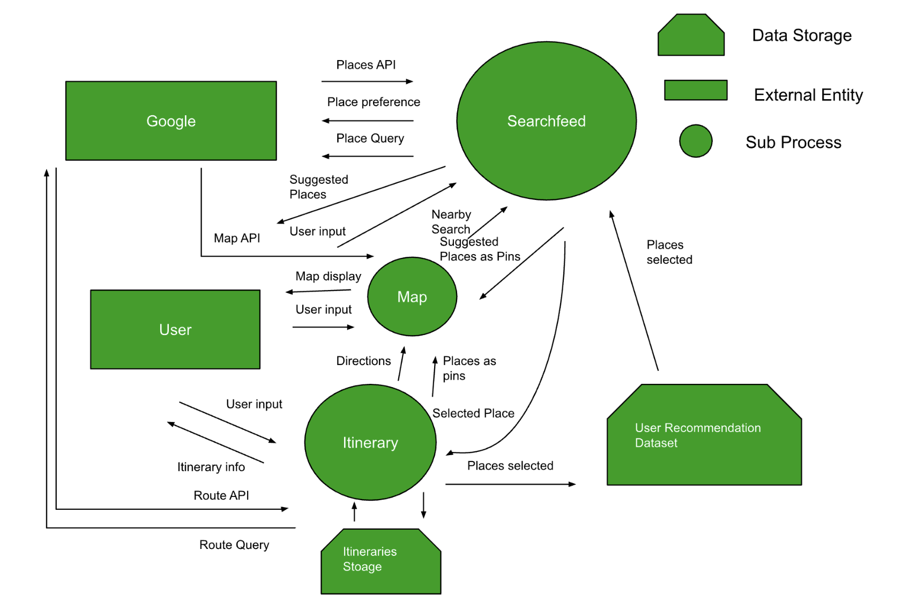
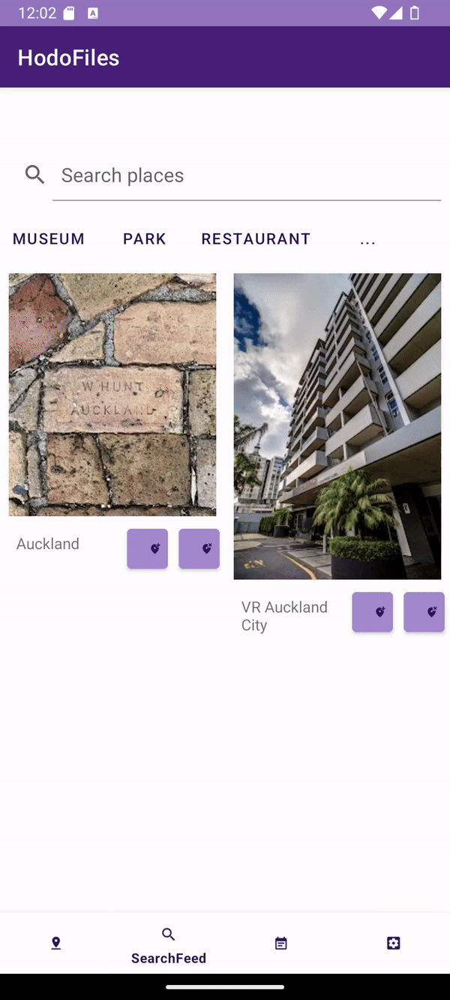
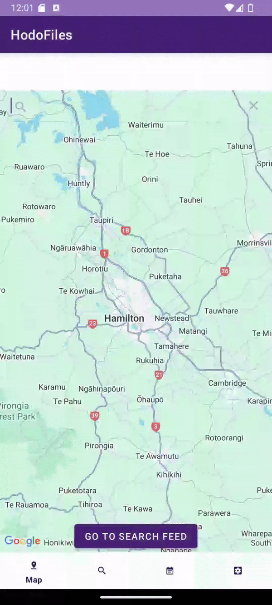

# Hodo-Files

**Simplifying travel planning with a Pinterest-styled interface.** 

Hodo-Files is an Android application designed to streamline the often complex process of travel planning. It provides a centralized, visually appealing platform for users to gather, organize, and visualize their travel ideas, addressing the common issue of information being scattered across multiple notes, bookmarks, and apps.

## Key Features

* **Interactive Map Planning:** Pin travel ideas, potential destinations, and activities directly onto an interactive map.
* **Pinterest-Style Interface:** Discover and organize travel inspiration through a "tile-based" visual layout, similar to Pinterest.
* **Personalized Itineraries:** Create and customize travel itineraries by adding selected activities, with the app helping to visualize routes between them.
* **Advanced Search & Filtering:** Search for activities and locations using various criteria such as distance, type of activity, cost, or personal preferences.
* **Activity Suggestions:** Receive recommendations for places and activities based on your preferences and selected filters.
* **Offline Access:** View your itineraries and make basic edits even when offline. An internet connection is typically needed for searching and adding new places.
* **Organize Your Ideas:** Group pinned locations, save images, notes, and other relevant information into custom lists or folders for specific trips or general inspiration.
## Target Audience

Hodo-Files is aimed at travel enthusiasts who enjoy discovering new places and want a more intuitive, organized, and visual way to plan their trips.

## Technologies Used

* **Platform:** Android (specifically Android Lollipop 5.1 and newer) 
* **Primary Languages:** Java, Kotlin 
* **Core APIs:**
    * Google Maps SDK (for map display and interaction) 
    * Google Places SDK (for finding places and activity details) 
    * Google Routes API (for calculating and displaying travel routes) 
* **Data Storage:** User itineraries and preferences are stored locally on the device.

## Getting Started (Simplified Usage)

1.  **Define Your Scope:** Start by selecting your travel destination or dropping a pin on the interactive map.
2.  **Filter Your Interests:** Narrow down options by specifying preferences like activity type, maximum distance you're willing to travel, cost, etc.
3.  **Discover & Collect:** Browse through suggested activities and places, which are displayed as visual tiles or map pins.
4.  **Build Your Itinerary:** Add interesting discoveries to your personalized travel itineraries.
5.  **Visualize Your Trip:** View your compiled plans as an organized list or geographically on the map, complete with routes between locations.

## Future Considerations

Based on project documents, potential enhancements could include:
* Autocomplete functionality in search bars.
* An adaptive algorithm for more personalized recommendations.
* Expanded filter options within the "Searchfeed".

## Screenshots
Settings User Interface
- .png)

- Itinerary User Interface
- .png)

- Search User Interface
- .png)

- Map User Interface
- .png)

- Data Flow Diagram
- 

## Videos
Selecting filters
- 

Searching the feed
- 

Searching the feed
- 
